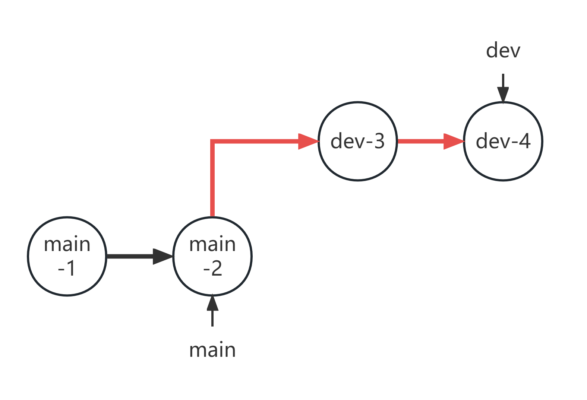
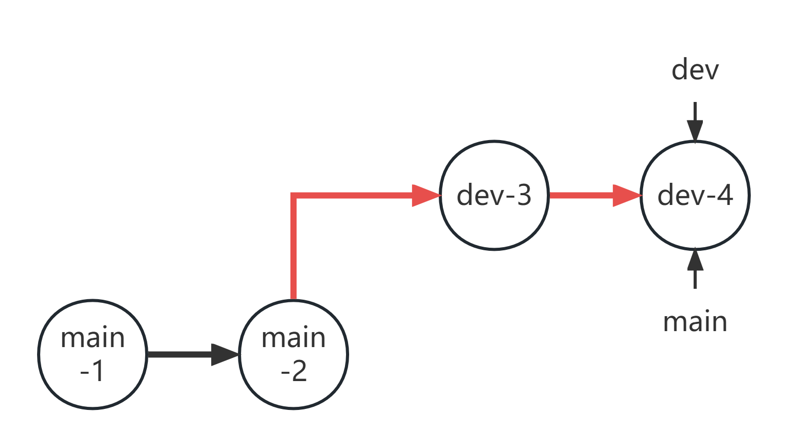
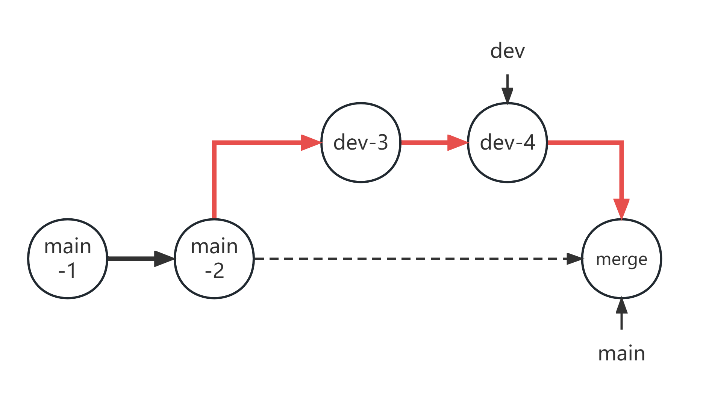
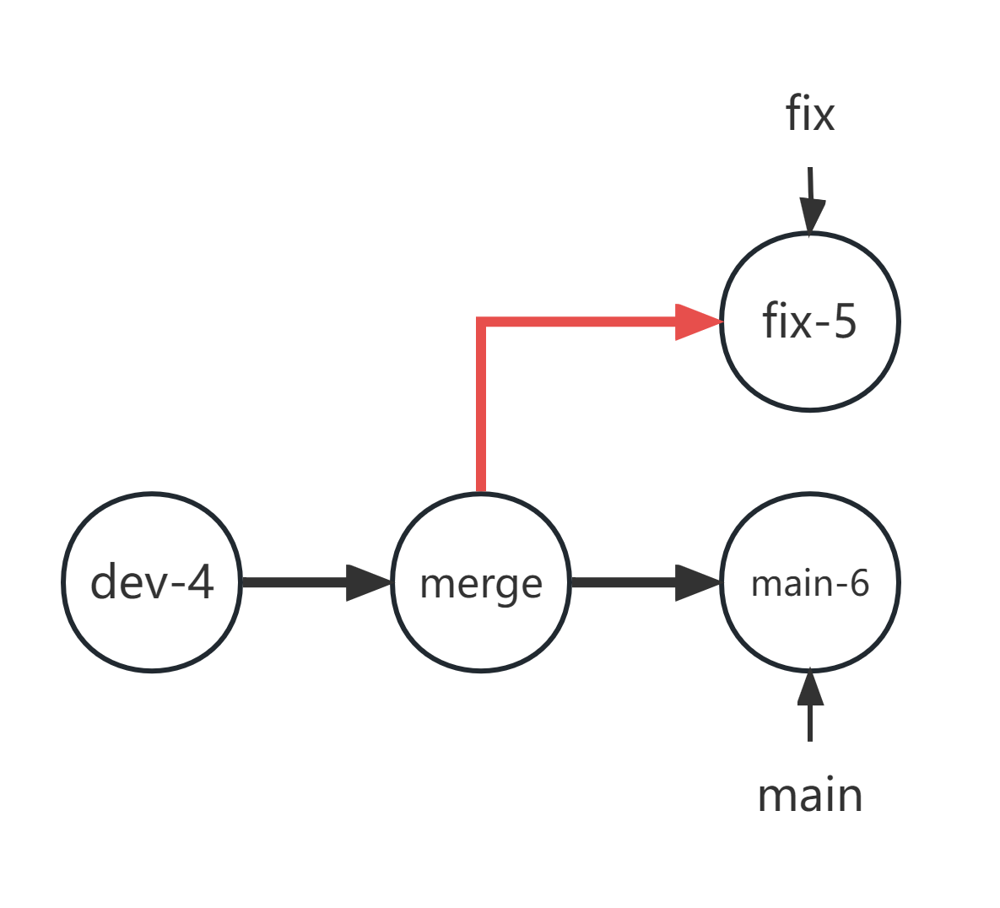
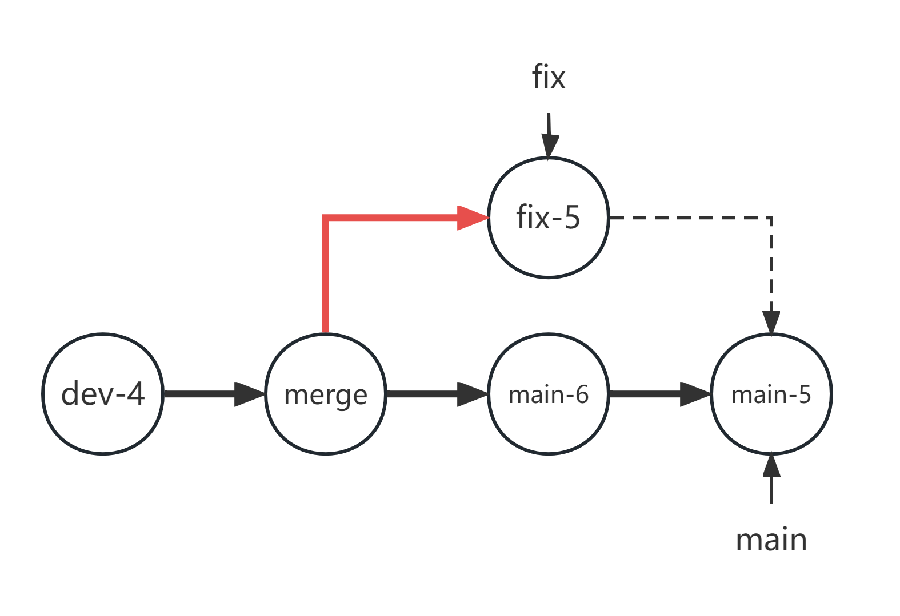
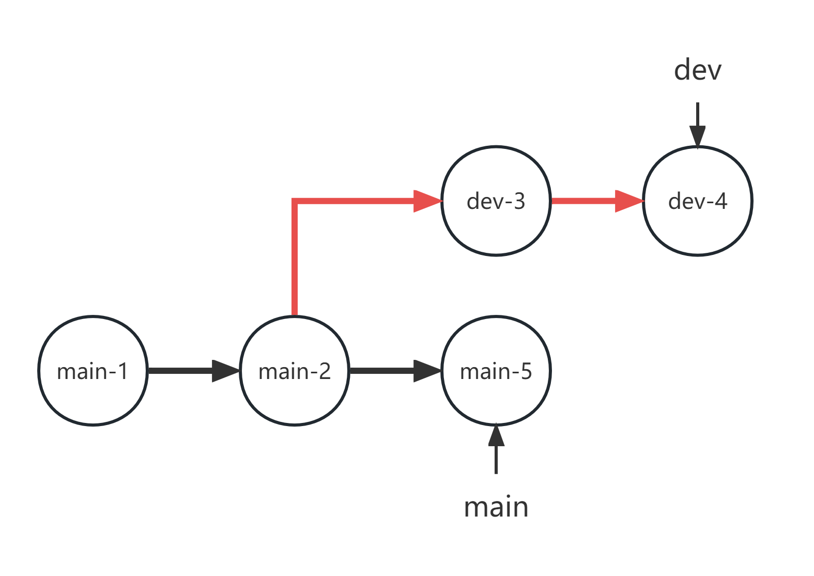
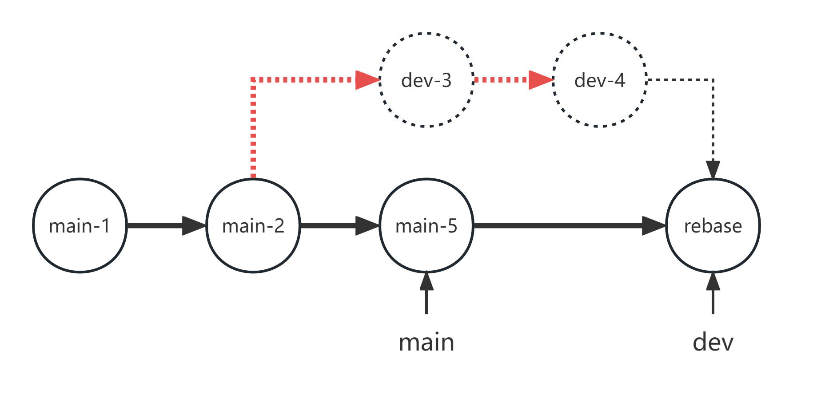

# 如何使用Git & GitHub ?

## Git简介


Git 是一个开源的分布式版本控制系统，用于敏捷高效地处理任何或小或大的项目。

Git 是 Linus Torvalds 为了帮助管理 Linux 内核开发而开发的一个开放源码的版本控制软件。

Git 与常用的版本控制工具 CVS, Subversion 等不同，它采用了分布式版本库的方式，不必服务器端软件支持。

(以上内容出自网络[菜鸟教程](https://www.runoob.com/git/git-tutorial.html))

## 如何安装Git?

## 如何使用Git?

首先讨论基于本地的操作(暂时不考虑远程仓库, 即GitHub)

### 创建分支

对于一个项目, 通常是一个文件夹. 在操作系统内打开文件夹, 并右键打开Git Bash(不同系统可能打开方式不同. 同时, Git还提供了图形界面, 但不推荐使用. 本教程也不会介绍图形界面的使用).

输入指令`git init`在当前目录创建一个仓库. 根据安装时设置, 默认仓库分支(后面会介绍到分支)名称可能会有所不同(master或main或者其他的名字). 创建完成后会在命令行右侧看到分支名(如下面的main分支)

```
qdzha@ZJQ-438 MINGW64 ~/Desktop/Git使用教程 (main)
```

### 一些本地基本操作

在介绍操作之前, 我们需要首先明确几个概念(这几个概念在Git当中很重要!)

- 工作区: 简单来说就是你电脑里的目录(你现在所编辑的内容就是工作区)
- 暂存区(缓存区): 简单来说就是你暂时提交修改的地方(具体方式我们后面再说). 如果更确切来说, 它会将暂存区保存在`.git/index`文件中(前面的`.`表明这是一个隐藏文件)
- 本地仓库, 也就是最终提交的地方.

一个不恰当的例子, 让我们类比西红柿炒鸡蛋的烹饪过程. 案板就是你的**工作区**, 你在上面切西红柿, 切葱花, 切完之后将它暂时放在盘子里(**暂存区**). 然后你又找到了一个碗打鸡蛋(**工作区**), 鸡蛋打匀后暂时放置在桌子上(**暂存区**). 你又在**工作区**准备好调料(油, 盐), 将它们暂时放在旁边便于拿到的地方(**暂存区**). 一切准备好之后, 你把所有食材放到锅里炒制(**本地仓库**), 最后得到一盘西红柿炒鸡蛋(哇哦~).

回到Git的工作过程, 你在本地目录下(也就是**工作区**)进行修改与编辑(可以创建文件, 可以修改文件, 也可以删除文件). 完成后将它们暂时保存在**暂存区**. 也许你还有别的需要修改的地方, 那就继续修改, 继续保存到暂存区. 循环往复, 直到你确认这次修改没有问题后, 将暂存区的文件一次性保存到**本地仓库**. 

下面的图很好说明了所有操作和你所操作环境之间的关系(我们暂时先不考虑远程仓库, 即remote repository)


下面的所有操作, 都是围绕这六个基本操作进行. 但首先, 让我们来看一下从工作区workspace到本地仓库local repository的过程

### `add`

正如在上图所见的那样, `add`命令用以将工作区的文件保存到暂存区. 这里面需要特别说明的一点是, 只有`add`命令, 换言之, 如果一个文件删除了, 将这个操作提交到暂存区, 也是使用`add`命令而不是其他的如`remove`命令等.

通常来说, 一个最简单最偷懒的方法, 可能是希望将所有修改提交到暂存区. 一个很简单的命令如下:
```
git add .
```
(请注意最后的`.`)

这一行命令用以将当前工作区所有修改提交到暂存区. 诚然, 这个方法很方便, 但很多时候我们可能不希望这样做. 比如, 我们有些程序代码在运行过程中可能会有很多临时文件(如C语言在编译的时候, 如果保留中间文件, 可能会有*.o,*.i等文件.), 这些文件可能并不希望将其保存. 一个一劳永逸的方法是创建一个文件`.gitignore`, 这个文件的作用就是告诉git, 请**忽视**这些文件! 我们在后面再来讨论它. 一个新手更容易接受的方法是, 使用`git add [文件名]`的方式将特定的文件添加到暂存区. 例如, 当前目录有三个文件(git.png, git-command.jpg, README.md), 可以使用下面的命令, 将三个文件一次性加入到缓存区: 
```
git add .
```

### `status`

这个指令并不在那几个基本操作里, 但是, 它却可以帮助我们理解这些文件的"去向". 例如, 当我们执行完上述操作后, 执行命令
```
git status
```
将会看到如下结果:

```
$ git status
On branch main

No commits yet

Changes to be committed:
  (use "git rm --cached <file>..." to unstage)
        new file:   README.md
        new file:   git-command.jpg
        new file:   git.png
```

这里表明, 我们在暂存区创建了三个新文件(还没有保存到本地仓库中). 使用这个`status`指令, 可以很方便帮助我们看到哪些文件还没有保存, 哪些文件又有过修改. 因此, **建议在每次执行操作之前确认当前文件状态**

### `commit`

将文件从暂存区保存到仓库中, 可以使用如下指令

```
git commit -m [备注信息]
```

上述命令会将缓存区所有文件提交到本地仓库当中并创建一个快照. 其中, 备注信息可以用来说明这次修改是什么. 例如, 执行如下命令:

```
git commit -m "第一次提交"
```

得到如下结果:

```
$ git commit -m "第一次提交"
[main (root-commit) 3d357c2] 第一次提交
 3 files changed, 100 insertions(+)
 create mode 100644 README.md
 create mode 100644 git-command.jpg
 create mode 100644 git.png
```

此时表明我们已经将这三个文件的修改存放到仓库中. 

如果只希望提交暂存区特定的文件, 也可以使用命令

```
git commit [文件] -m [备注信息]
```

如果没有`-m`, git将会打开一个文本文件让你添加修改信息(在没有默认设置的情况下, 启动vim).

### `log`

`git log`指令用以查看提交日志, 例如, 我们可以使用这个指令查看我们目前的提交过程如下:

```
$ git log
commit 3d357c2fa30b45bbfa24157ca1884dc845caf58f (HEAD -> main)
Author: JackyZhang00 <qdzhangjiaqi@126.com>
Date:   Sun Oct 22 17:32:11 2023 +0800

    第一次提交
```

其中, `commit`表示提交信息(后面的数值是一个Hash值, 用以确定每次提交的编号), 括号里面的`HEAD`是"头指针", 关于`HEAD`将在介绍分支时详细说明. 后面的`Author`和`Date`说明提交作者和时间. 下面的文字则是我们的备注信息. 

在有些时候, 我们可能不希望输出这么多信息(尤其是提交次数较多时). 那可以执行如下命令:
```
git log --oneline
```
输出简短的日志如下:

```
$ git log --oneline
3d357c2 (HEAD -> main) 第一次提交
```

前面的数字表示Hash值(只输出前7位), 后面的`HEAD`表示头指针. 后面的文字是备注信息.

### 关于分支(这一部分真的非常重要!!)

正如标题所见, 这一部分真的非常重要!! 因为它很大程度上贯穿Git始终.

让我们先来讨论一下什么是分支.

在Git里面, 你的每一次提交都是在一个分支下进行的. 我们当前只有一个分支, 也就是刚开始创建的`main`分支(也许你有其他名字). 当你每次执行`git commit`指令时, 都是相当于在当前分支下继续添加一个新的"节点". 例如, 原来的提交是A, 当我们在同一个分支(我们目前还没有学其他分支)提交B时, 从逻辑上来看, 有点类似于A-->B的过程. 类似地, 我们也可以有更多次的提交, 于是这条线会越来越长, 例如, A-->B-->C-->D-->E.

但是, 如果Git真的只是这样的话, 那岂不是太无趣了吗? 事实上, Git的杀手锏在于, 它可以创建更多的分支. 形成类似于下图的结构:


说到分支, 我们又不得不提那个`HEAD`指针. 所谓`HEAD`, 简单来说, 就是你当前所在的节点(和它所在的"分支"). 我们现在只有一个分支, 而且只知道如何向前添加, 因此`HEAD`指针一定指向最前端的那个节点. 但是, 随着后面的操作逐渐深入, 我们有可能会创建更多的分支, 甚至有可能会"回退"到之前的节点. 那么, 这个`HEAD`对于指明分支和节点, 就变得很重要了.

既然说了这么多, 那肯定已经迫不及待想要见识一下分支的魅力了! 首先, 让我们从创建分支开始:

### `branch`

一个很简单的方法, 在git里面创建分支只需要执行下面的命令

```
git branch [节点名]
```

即可在当前`HEAD`指针所指节点处创建一个名为[节点名]分支. 

*这里有必要说明的一点是, 此时`HEAD`指针所指的节点看似属于两个分支, 但实际上它们两个是不一样的. 这也就是为什么在查看`log`的时候, 会特别强调`HEAD->main`还是别的分支(那个`main`就是分支)*

例如, 我们现在创建一个名为"test"的分支. 就可以执行下面的命令:

```
git branch test
```

为了查看当前所有的分支, 也可以直接执行下面的命令:

```
git branch
```
得到如下结果:

```
$ git branch
* main
  test
```
(前面的星号表示我们当前所处在的分支是main分支)

### `checkout`

从前面的图来看, 这个操作是一个基本操作(用以将本地仓库的内容存放到工作区). 但它的具体操作原理是什么呢? 要从分支开始入手.

在开始之前, 让我们先来做一些准备工作. 首先, 让我们先切换分支. 方法如下:

```
git checkout [分支名]
```

要进行我们的实验操作, 需要先切换的`test`分支, 则执行指令
```
git checkout test
```
即可.

完成后, 在工作区创建文件`111.txt`, 并将这个修改`commit`到本地仓库. 查看`log`, 会有如下输出结果:

```
$ git log --oneline
0127943 (HEAD -> test) 111.txt
eba263b (main) 第三次提交
a3dc029 第二次提交
3d357c2 第一次提交
```

(这里面前面几次提交都是为了保存数据而用, 不是关键)

下面, 当你执行指令`git checkout main`的时候, 将会发现那个`111.txt`文件不见了. 这也就意味着, 你回到了前面的那个`main`分支, 也就是上面的那个`eba263b`的那次提交.

当然, 这并不是意味着那个`111.txt`文件消失了, 你仍然可以使用`git checkout test`回到`test`分支. 当然, 我们也可以继续在`main`分支下提交. 例如, 让我们再保存一下`main`分支的当前文件. 并试着用`log`查看一下

```
$ git log --oneline
2397864 (HEAD -> main) 第四次提交
eba263b 第三次提交
a3dc029 第二次提交
3d357c2 第一次提交
```

然而, 需要特别注意的是, 你所看到的, 是当前分支从开始到`HEAD`所能看到的提交记录. 因为那个`test`分支在前面已经出现了"分叉", 因此在这里是看不到的. 

事实上, `checkout`的作用远不止此. 当你希望恢复到之前的一次提交时, 也可以使用`checkout`指令. 例如, 若希望回到第一次提交的时候, 则可以使用下面的指令`git checkout 3d357c2`回到第一次提交的时候. 在那个基础上, 你可以继续进行其他的操作, 例如, 你可以在那个节点继续创建分支.

### `merge`

在工作过程中, 总会或多或少创建很多分支. 从习惯上来说, 我们会有一个主分支用以上传稳定版本, 同时还会有一个开发分支用以开发新版本, 同时还可能会有修复bug的分支. 当然, 如果是多人合作的话, 通常每个人也会在各自的分支下进行操作. 这样做的一大好处就是, **每次进行的修改都不会影响到之前的版本, 也不会影响到别人的进度**. 但是, 我们总归是希望将一些节点合并到主分支上的(例如, 当我们完成了一个功能, 希望将其发布时). 在这种情况下, 我们就需要用到**分支合并**. 分支合并的一个基本方法, 是使用`merge`指令. 

为了演示方便, 我们再单独创建一个仓库. 为了便于练习, 请创建一个目录`test`, 同时调用`git init`命令在该目录创建仓库. 然后执行如下操作:
- 创建一个文本文件`a.txt`, 在里面输入字符串`main-1`, 提交仓库并备注`main-1`
- 添加字符串`main-2`, 提交仓库并备注`main-2`
- 创建一个新的分支`dev`(使用指令`git branch dev`), 并转到该分支下(`git checkout dev`)
- 添加字符串`dev-3`, 提交仓库并备注`dev-3`
- 添加字符串`dev-4`, 提交仓库并备注`dev-4`

当你完成上述步骤后, 调用`git log --oneline`, 应当会得到类似于下面所示的结果:
```
$ git log --oneline
3b920b2 (HEAD -> dev) dev-4
2a01622 dev-3
31d46a1 (main) main-2
4e498f1 main-1
```

正如你所看见的那样, 最后生成的结构图如下所示(其中红线表示dev分支, 黑线表示main分支. 此时`HEAD`在dev分支上):



假设从实际角度来看, dev-4节点已经是我们开发完成之后的节点, 希望将其合并到main. 则需要将`dev-4`节点创建到`main`分支下. 在Git当中, 一个比较简单的方法是使用`git merge`指令. 但在执行该指令前, 你需要确保**当前所在的分支是接收合并的分支**, 例如在本例中, 需要首先`git checkout main`

(当你执行上述命令后, 也可以明显看到, `a.txt`文件内只有两行`main-1`和`main-2`)

合并时, `merge`的格式如下:

```
git merge [分支名]
```

例如, 在本例中, 使用指令
```
git merge dev
```
便可以将`dev`分支合并到`main`分支当中.(合并之后, 你可以看到`a.txt`文件有了`dev-3`和`dev-4`两行).那么, 它究竟是怎么做的呢? 让我们再来检视一下上面的结构图. 我们可以注意到, `main`分支的指针和`dev`分支的指针是线性关系. 换句话说, **你可以通过向前移动`dev`来回到`main`指针所在节点**. 在这种情况下, Git执行"快速向前合并", 即简单的将`main`指针移动到`dev`指针所在节点处如下所示:



(特别注意的是, 对于这种快速向前合并而言, Git并没有创建新的提交记录. 因此, 若你执行`git log`的话, 只会看到前面的四个记录节点). 如果你希望再创建一个新的合并节点, 则可以使用`merge`指令的参数`--no-ff`来创建一个新的节点. 例如, 对于上面的例子, 我们可以调用指令:
```
git merge --no-ff dev
```
创建一个新的合并节点, 此时查看`git log`得到如下结果:
```
$ git log --oneline
935f8ed (HEAD -> main) Merge branch 'dev'
01b7beb (dev) dev-4
c8aee45 dev-3
613cabd main-2
7445fbd main-1
```
如图所示:


然而, 在大多数时候, 我们可能会在原有基础上进行修改. 请按照如下操作进行准备:
- 删除目前的`dev`分支(使用指令`git branch -d dev`删除).*注意, 当你删除dev分支时并没有删除`dev-3`节点和`dev-4`节点. 你删除的分支实际上仅仅是一个指针而已, 对于合并后的`main`分支而言, 它同样可以回溯到那两个节点(哪怕我们使用的是--no-ff合并)*
- 创建一个新的分支`fix`(`git branch fix`)并切换到该分支(`git checkout fix`)
- 在`a.txt`中添加字符串`fix-5`, 并提交到仓库, 备注`fix-5`
- 回到`main`分支(`git checkout main`)
- 在`a.txt`中添加字符串`main-6`, 并提交到仓库, 备注`main-6`

此时的结构如下图所示(为了简洁, 我们省略`dev-3`及之前节点)



与之前不同的是, `fix`和`main`之间的关系不像前面那样是个"线性关系", 即`fix`不能只靠向后追溯就追溯到`main`指针. 事实上, 这种情况可能更常见, 一个最常见的例子是, 两个人共同开发一个程序的不同部分, 此时就很容易出现这种"齐头并进"的情况. 事实上, 对于这种情况, Git也没有给我们一个更好的合并方法. 当我们希望将此时的`fix`合并到`main`分支时, 按照之前的方法, 则会出现"**冲突**"("冲突"不是"错误", 冲突是很常见的一种情况, 不要害怕). 而Git给我们解决冲突的方法很简单, **自己处理**. 让我们试着合并一下上面的分支. 首先切换的`main`分支(`git checkout main`), 然后试着合并`git merge fix`, 则会出现如下输出结果:

```
$ git merge fix
Auto-merging a.txt
CONFLICT (content): Merge conflict in a.txt
Automatic merge failed; fix conflicts and then commit the result.
```

此时表明合并出现了conflict(冲突), 若我们试着看一下`a.txt`文件, 则会看到这个文件变成了这个样子:
```
main-1
main-2
dev-3
dev-4
<<<<<<< HEAD
main-6
=======
fix-5
>>>>>>> fix
```
Git把两个分支修改的部分都给列出来了, 我们就需要再查看一下这个文件, 同时试着将这错误全部修改(可以选择保留现在的, 也就是`main`分支下(在冲突里面以`HEAD`表示当前分支), 也可以选择保留传入的, 也就是`fix`分支, 当然你也可以两个都不要, 或者两个都要. 你也可以对其进行进一步更改.) 

比如说, 让我们考虑一个更一般的情况, 我们现在希望两个都要, 同时将那个`main-6`修改为`main-5`, 则可以直接在文本编辑器内修改(无论你是用自己电脑的文本编辑器, 亦或者使用Git Bash下的vim等). 修改后结果如下:
```
main-1
main-2
dev-3
dev-4
main-5
fix-5
```
此时再如同添加新节点一般, 提交新的commit并备注, 例如我们这里备注`main-5`, 此时的节点结构就如同下图所示:



### `rebase` 一种合并分支的新方法

下面我们再来介绍一种合并分支的新思路, 即**变基**. 注意, 下面的讨论仅针对于`merge`无法快速合并的情况(即有可能会有冲突的情况). 让我们重新创建一个仓库. 按照如下过程准备:
- 创建目录`test`并创建仓库`git init`
- 创建文本文件`a.txt`, 并添加字符串`main-1`, 提交仓库备注`main-1`
- 添加字符串`main-2`, 提交仓库备注`main-2`
- 创建分支`dev`, 切换到该分支
- 添加字符串`dev-3`, 提交仓库并备注`dev-3`
- 添加字符串`dev-4`, 提交仓库并备注`dev-4`
- 切换到`main`分支, 添加字符串`main-5`, 提交仓库备注`main-5`

此时得到的结构如下所示


所谓变基, 简单来说就是将一个分支下的所有修改, 重新应用到另一个分支当中(就如同将基底变化了一般), 例如, 我们希望将`dev`分支的修改重新应用到`main`分支, 则可以执行下面的命令
```
git rebase main dev
```
(注意先后顺序, 这条指令表明, 以`main`当前所在指针为基底, 将`dev`的修改以此应用到基底上). 这样执行后, Git会依次将`dev`上的修改应用到`main`分支上, 此时可能会出现冲突, 解决它们(使用`git rebase --continue`应用修改), 全部应用完成后得到的分支关系如下所示:



此时, `dev-3`和`dev-4`节点就可以如同没有一般, 我们可以很容易使用`merge`进行快速合并. 请注意, 此时若查看提交历史`git log`, 则会发现没有`dev-3`和`dev-4`节点. 因此, 当其他人有可能基于这些提交进行进一步修改时, 永远不要使用变基操作. 当然, 你也可以很"自然"地删除`dev`分支